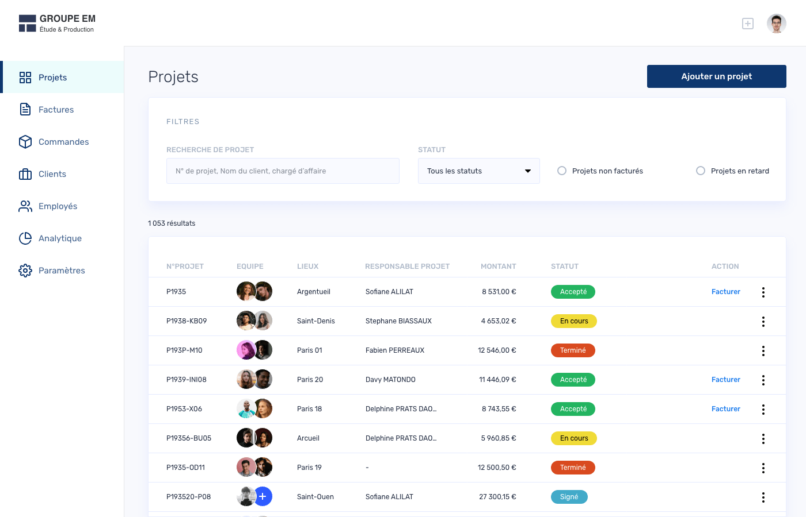

<p align="center">
  <a href="https://www.case.app">
    
  </a>
</p>
<h1 align="center" style="font-weight: bold">
  CASE Starter
</h1>

This starter allows you to launch an application or an ERP using CASE with pre-configured minimum features. CASE is fully customizable open to contributions. You can contribute by adding features, reporting bugs or participating in discussions.



# Quick start

Follow our [quickstart guide](https://docs.case.app) to learn how to set up a CASE project step by step.

# Getting started

1. **Install CASE CLI**

   ```sh
   npm i -g @case-app/case-cli
   ```

2. **Create a new CASE proejct**

   ```sh
   case-app new
   ```

   During the installation, when the terminal asks you what is the name of your application, just write your application's name and press `Enter`.

   The CLI will create a monorepo and install dependencies.

3. **Run your project**

   ```sh
   cd my-case-project

   #1st terminal window
   npm run start:client

   #2nd terminal window
   npm run start:server
   ```

   The frontend server will run here => http://localhost:4200

   The backend server will run here => http://localhost:3000

4. **Seed the data**

   ```sh
   npm run seed
   ```

5. **Got http://localhost:4200/**
   And Use your CASE admin’s user credentials to log in.

   > You can use the email `admin@case.app` and password `case` to log in.

# Deploying to production

...Coming soon
